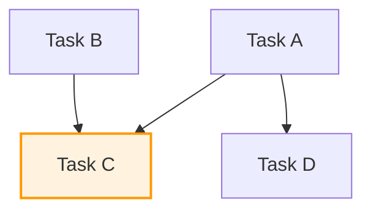
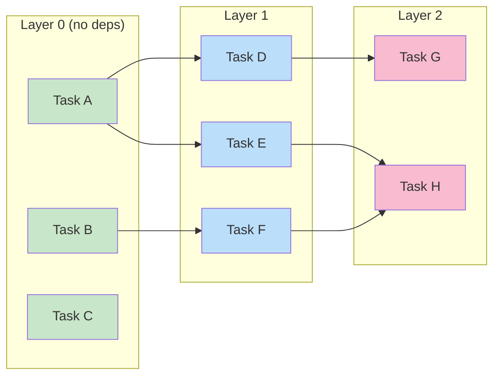

# Phase 0: Decomposition

## Input

The user provides a description of a large body of work. Check these sources **in order** — earlier sources are more structured and save decomposition work:

1. **Existing plan.md + SQL todos** (from plan mode) — The user typically uses plan mode first to generate a plan.md with tasks and a `todos`/`todo_deps` table. If these exist, use them as the primary input — the decomposition is largely done. Read `plan.md`, query `SELECT * FROM todos`, and `SELECT * FROM todo_deps` to bootstrap the DAG.
2. **An OpenSpec `tasks.md`** — Spec-driven workflow output with structured tasks and dependencies.
3. **An ADO Work Item (PBI/Epic)** with child tasks — Use ADO APIs to pull the hierarchy.
4. **A freetext description** — Analyze and decompose from scratch.
5. **A session plan from a previous session** — Resume where a prior session left off.

## Step 0.1: Build the Work DAG

Analyze the work and produce a **directed acyclic graph** where:
- **Nodes** = logical units of work (e.g., "Enable LocalWithMocks for ARG Adapter tests")
- **Edges** = dependencies (e.g., "ServiceBus trace headers must be done before DataAcquisition unification")

Ask clarifying questions to establish dependencies:
- Which tasks can proceed independently?
- Which tasks require code from another task to exist first?
- Are there shared fixtures, interfaces, or infrastructure changes that others depend on?

## Step 0.2: Decompose Each Node

Each node is a PR-sized unit of work. Within a node, there may be multiple sub-tasks:
- **Parallelizable**: Sub-tasks that don't modify the same files or depend on each other's output
- **Sequential**: Sub-tasks that must happen in order (e.g., write interface → implement → write tests). This is common and expected — the fleet agent handles the sequencing internally.

## Step 0.3: Identify Unprocessable Nodes

If a node has **multiple antecedents from different layers**, it cannot be processed yet because it would need a merge of multiple branches. Mark these as **deferred** and note them for the user.



> **Task C** depends on both A and B. If A and B are in the same layer, C is still deferred — it needs both branches' changes, and branching from only one would miss the other. Wait for both PRs to merge to main, then branch C from the updated main.

## Step 0.4: Output

Produce a summary table:

| Node | Tasks | Layer | Depends On | Worktree Base | Status |
|------|-------|-------|------------|---------------|--------|
| T0: Manifest attr cleanup | 1 | 0 | — | origin/main | Ready |
| T1: DVT test consolidation | 1 | 0 | — | origin/main | Ready |
| T2: ARG adapter test modes | 1 | 0 | — | origin/main | Ready |
| T3: Data acquisition unify | 1 | 1 | T0 | T0 branch | Blocked |
| T4: ServiceBus trace headers | 1 | 0 | — | origin/main | Ready |
| T5: DurableTask tracing | 1 | 1 | T4 | T4 branch | Blocked |

Store in SQL for tracking:

```sql
INSERT INTO todos (id, title, description, status) VALUES
  ('t0-manifest', 'Manifest attr cleanup', '...', 'pending'),
  ('t1-dvt', 'DVT test consolidation', '...', 'pending');

INSERT INTO todo_deps (todo_id, depends_on) VALUES
  ('t3-data-acq', 't0-manifest'),
  ('t5-durabletask', 't4-servicebus');
```

**Checkpoint:** Present the DAG and table to the user. Wait for confirmation before proceeding.

## Topological Layering


