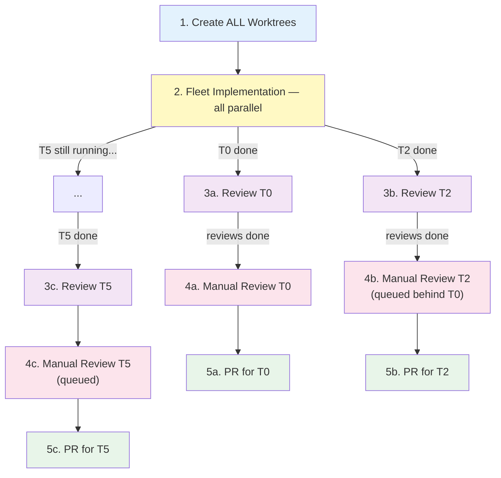
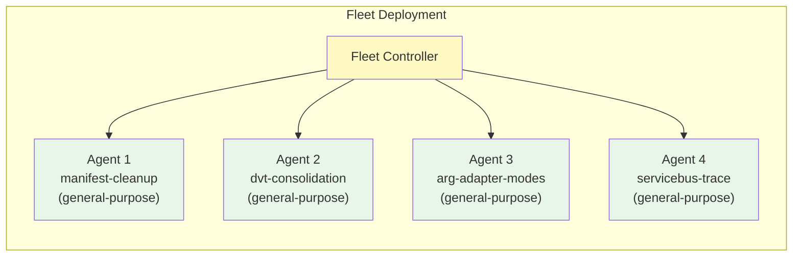
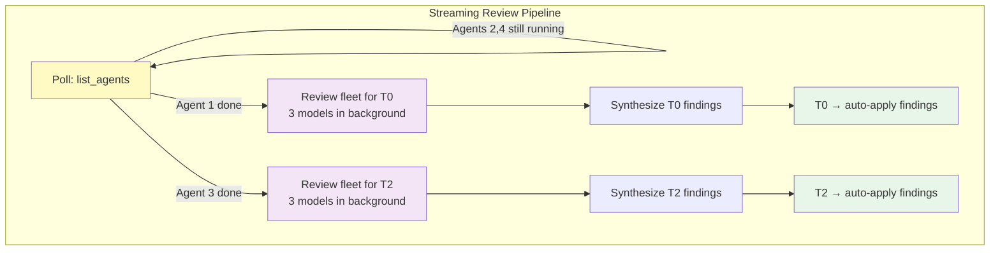
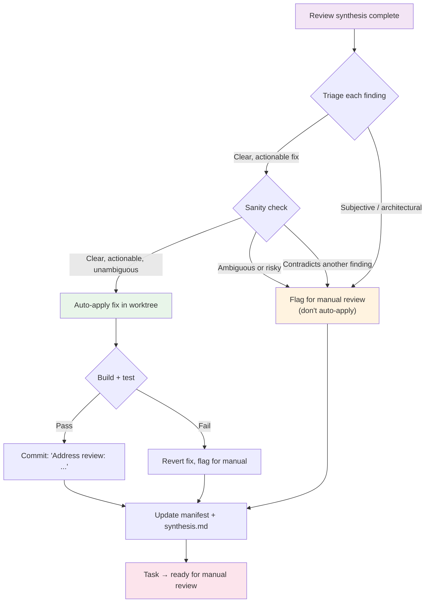
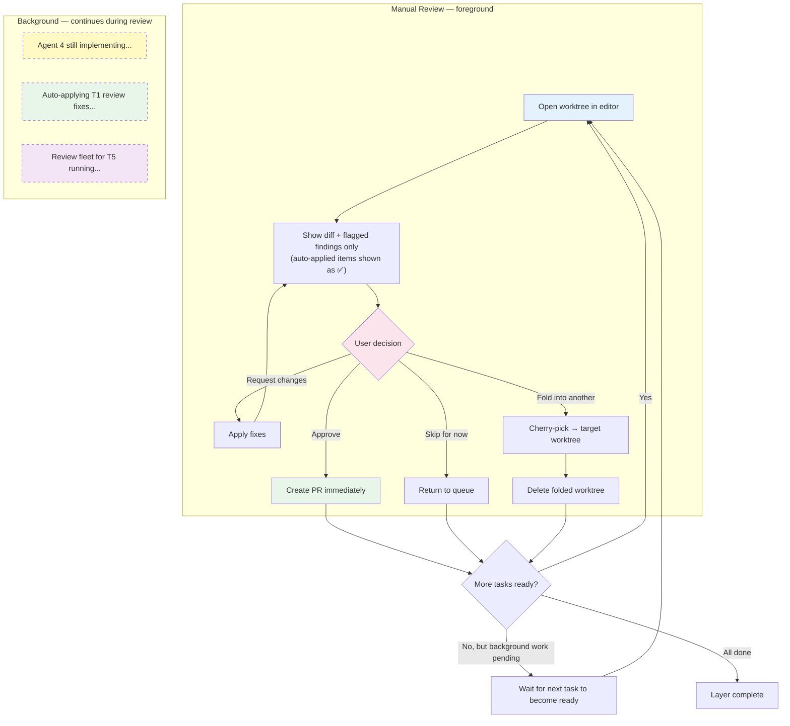

# Inner Loop: Per-Layer Streaming Pipeline

This is the core execution pipeline. For a batch of parallelizable tasks in a single layer, all stages pipeline independently — no stage waits for all tasks to finish before the next one starts.



**Key principle:** Manual review is the bottleneck (it requires the human). Everything before it — implementation and code review — should pipeline so the user always has something ready to review.

## Step 1: Create Worktrees

See [worktree-naming.md](./worktree-naming.md) for naming conventions and branching rules.

Use the `create-worktree` skill, overriding the branch source when chaining from a parent:

```powershell
$swarm = "auth-refactor"
$worktreeRoot = Join-Path (Split-Path $gitRoot -Parent) "$repoName.worktrees" $swarm

# Layer 0: branch from origin/main
git worktree add -b "feature/$user/$swarm/t0-auth-interface" `
    "$worktreeRoot/t0-auth-interface" origin/main

# Layer 1: branch from parent task's branch
git worktree add -b "feature/$user/$swarm/t3-jwt-provider" `
    "$worktreeRoot/t3-jwt-provider" "feature/$user/$swarm/t0-auth-interface"
```

## Step 2: Fleet Implementation

Deploy **fleet of agents** — one per worktree — all in parallel:



Each agent receives:
- **Task description**: What to implement, which files to change, acceptance criteria
- **Worktree path**: `cd` into the worktree before starting
- **Context**: Any relevant session plan, ADO work item details, or prior analysis
- **Instructions**: Make the changes, build, test, commit (don't push)

Launch via `task` tool with `mode: "background"`:

```
task(agent_type: "general-purpose", mode: "background", prompt: """
cd C:\_SRC\ZTS.worktrees\manifest-cleanup

Task: Remove allowedRunModes from all ManifestBuilder tests (they're pure unit tests).
- Files: src/DataProcessing/DataProcessing.Tests/Manifest/ManifestBuilderTests.cs
- Remove `allowedRunModes: TestRunModes.X` from all [ConfigurableFact] attributes
- Build: dotnet build
- Test: dotnet test --filter ManifestBuilder
- Commit with descriptive message
""")
```

### Parallelism within each agent

Each implementation agent is itself a `general-purpose` agent with full tool access. If a single node's task involves **multiple independent sub-tasks** (e.g., editing 4 different test files that don't interact), the agent should use parallel tool calls within its own context. The orchestrator's prompt should explicitly tell the agent which sub-tasks are independent:

```
task(agent_type: "general-purpose", mode: "background", prompt: """
cd C:\_SRC\ZTS.worktrees\attr-cleanup

This node has 3 independent sub-tasks. Parallelize where possible:

1. ManifestBuilderTests.cs — Remove allowedRunModes (pure unit tests)
2. DvtTests.cs — Fold _Dvt() suffixed methods into base methods, add Dvt to environments
3. ArnHandlerTests.cs — Widen to AnyTestMode

Each sub-task touches different files — do them in parallel.
Build and test after all changes: dotnet build && dotnet test
Commit each sub-task separately.
""")
```

**Don't wait for all agents to finish.** Poll with `list_agents` and as each agent completes, immediately kick off its code review (Step 3). Other agents keep running.

## Step 3: Multi-Model Code Review (per-task, streaming)

As soon as a fleet agent completes, launch its **review fleet** — don't wait for the other agents:



For each completed task, launch 3 `code-review` agents in background (one per model):

```
task(agent_type: "code-review", mode: "background", model: "gpt-5.3-codex", prompt: """
Review changes in: C:\_SRC\ZTS.worktrees\manifest-cleanup
Run: git diff main
Review for correctness, test coverage, edge cases, style.
Rate issues as CRITICAL / IMPORTANT / MINOR.
""")
```

When all 3 reviews for a task complete:
- Deduplicate across models (consensus = higher confidence)
- Escalate severity on disagreements (take the higher)
- Save findings to `files/reviews/layer-N/<task-id>-synthesis.md`

## Step 3.5: Auto-Apply Review Findings

After review synthesis, the orchestrator **automatically applies** review findings — don't wait for the human. The user reviews already-refined code, not raw first drafts plus a list of comments.



### Sanity Check Criteria

A review finding is **auto-applicable** if ALL of these are true:
- The fix is **unambiguous** — there's only one reasonable way to address it
- It's **localized** — affects a small, well-defined code region
- It **doesn't contradict** another finding from a different model
- The fix can be **verified** by build + test

Severity doesn't gate auto-apply — a MINOR trailing-whitespace fix and a CRITICAL logic bug fix both get applied if they're clear and verifiable. The only gate is whether the fix is unambiguous and safe.

Findings that are **flagged for manual review** (not auto-applied):
- Ambiguous or subjective (e.g., "consider renaming this variable")
- Architectural (e.g., "this should use a different pattern")
- Contradicted by another model's finding
- Would require significant refactoring
- Can't be verified by build/test alone

### Auto-Apply Procedure

For each auto-applicable finding:
1. Launch a `general-purpose` agent targeting the worktree:
   ```
   task(agent_type: "general-purpose", prompt: """
   cd C:\_SRC\ZTS.worktrees\manifest-cleanup
   
   Apply this review finding:
   [Finding: Default allowedRunModes is LocalWithMocks, not AnyTestMode.
    Removing the attribute doesn't mean "run everywhere".]
   
   Fix: Add explicit `allowedRunModes: TestRunModes.AnyTestMode` to each attribute.
   Build: dotnet build
   Test: dotnet test --filter ManifestBuilder
   If build/test fails, revert your changes and report the failure.
   Commit: "Address review: explicit AnyTestMode for ManifestBuilder tests"
   """)
   ```
2. If build/test passes → commit stands, finding marked `addressed`
3. If build/test fails → revert, finding marked `flagged_for_manual`

### Updated Synthesis File

After auto-apply, the synthesis file is updated:

```markdown
## T0: Manifest Attr Cleanup — Review Synthesis

### 🔴 CRITICAL (1) — auto-applied
- **Default allowedRunModes is LocalWithMocks, not AnyTestMode**
  - Found by: Sonnet 4.6, Gemini 3 Pro (consensus)
  - ✅ Auto-applied: Added explicit AnyTestMode (commit a1b2c3d)

### 🟡 IMPORTANT (1) — flagged for manual
- **ManifestTests.cs uses real BlobStorageClient — decouple first?**
  - Found by: Codex 5.3
  - ⚠️ Flagged: Architectural — requires decision on scope

### 🟢 MINOR (2) — auto-applied
- ✅ Trailing whitespace on line 47 (Codex) — removed (commit d4e5f6g)
- ✅ Missing XML doc comment on `ValidSingleManifest` (Gemini) — added (commit d4e5f6g)
```

## Step 4: Manual Review (one at a time, never blocked)

The user reviews tasks **one at a time**, in the order they become ready. By this point, CRITICAL and IMPORTANT review findings have already been auto-applied — the user is reviewing **refined code**, not raw output. Only flagged items need human judgment.

Meanwhile, implementation, review, and auto-apply of other tasks continue in the background.



For each task presented:
1. Open in VS Code (`code-insiders <worktree-path>`)
2. Show the diff (including auto-applied commits) and **only flagged findings** that need human judgment
3. User reviews — most review items are already resolved
4. Make any remaining requested changes
5. On approval → **immediately** push + create PR (don't batch)

## Step 5: Create PR (immediately on approval)

Each PR is created **as soon as** the user approves the worktree — no batching:

1. **Push** the branch to remote
2. **Create PR** via ADO REST API (for multiline descriptions) or `az repos pr create`
3. **Link work items** to the PR
4. **Set reviewers** (suggest based on code owners or user preference)
5. **Update SQL**: `status → pr_created`, record `pr_url`

```powershell
# Push
git -C $worktreePath push -u origin $branchName

# Create PR (ADO REST for multiline descriptions)
az repos pr create --repository $repo --source-branch $branchName --target-branch main `
  --title "T0: Remove unnecessary allowedRunModes from ManifestBuilder tests" `
  --description "..." --work-items $workItemId
```

Then immediately present the **next ready task** for manual review (if one is ready).

## Step 6: Layer Completion & Cleanup

A layer is complete when every task in it is either `done`, `pr_created`, or `consolidated`.

After all tasks in a layer reach terminal state:
1. Optionally delete worktrees (`git worktree remove <path>`)
2. Update SQL: increment `current_layer`
3. Check if any Layer N+1 nodes are now unblocked
4. Report layer summary to user
5. Begin Layer N+1 (back to Step 1)

## Consolidation

If the user decides a small task should be folded into a larger one:
1. Cherry-pick the commits from the small worktree onto the larger one
2. Update SQL tracking
3. Update linked work items
4. Delete the folded worktree and branch
