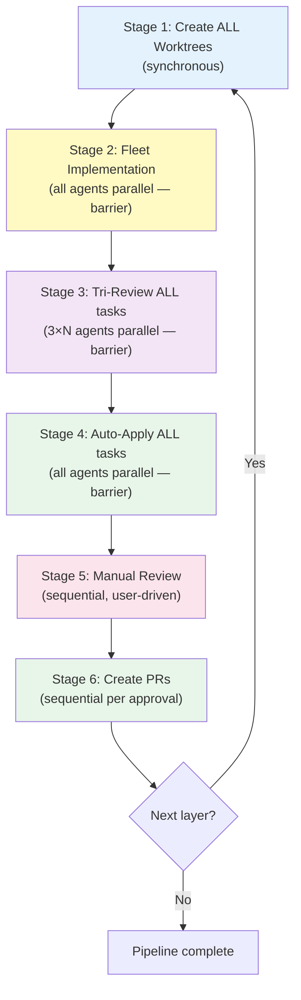
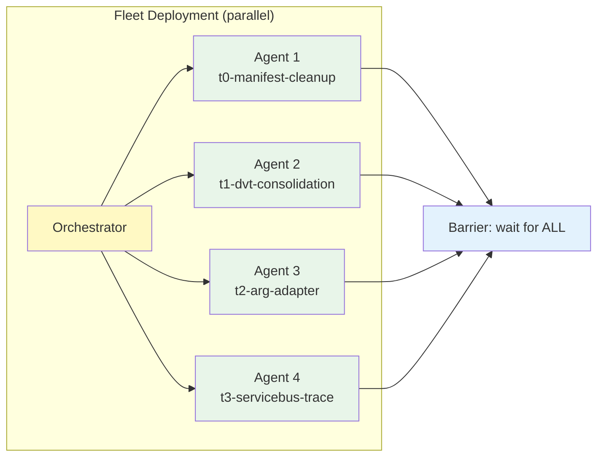
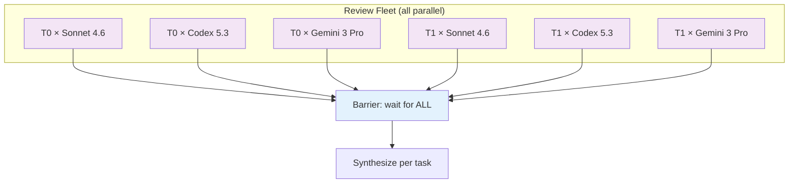
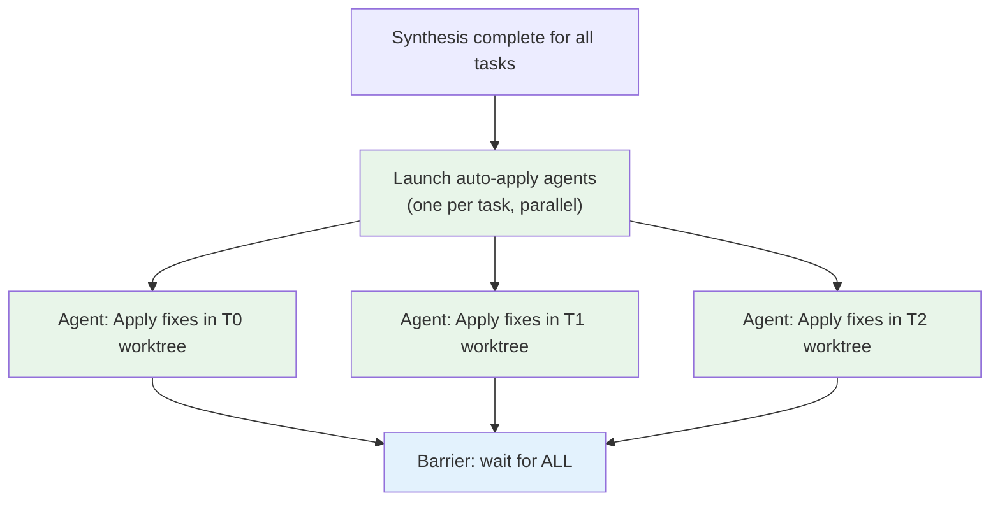
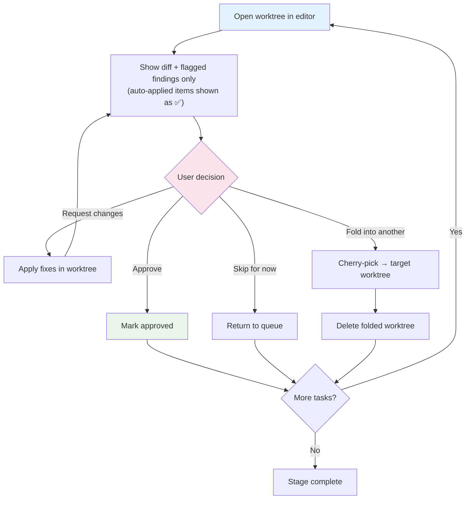

# Inner Loop: Per-Layer Batch Pipeline

This is the core execution pipeline. For each layer of the DAG, all tasks move through **6 sequential batch stages**. Each stage completes fully (barrier) before the next begins. Within a stage, tasks run in parallel.



**Key principle:** Each stage is a clean batch with a barrier — no interleaving of stages, no polling, no streaming. Parallelism happens *within* each stage (multiple agents), not *across* stages.

## Stage 1: Create Worktrees

Create all worktrees for the layer at once. See [worktree-naming.md](./worktree-naming.md) for naming conventions and branching rules.

```powershell
$swarm = "auth-refactor"
$worktreeRoot = Join-Path (Split-Path $gitRoot -Parent) "$repoName.worktrees" $swarm

# Layer 0: branch from origin/main
git worktree add -b "feature/$user/$swarm/t0-auth-interface" `
    "$worktreeRoot/t0-auth-interface" origin/main

# Layer 1: branch from parent task's branch
git worktree add -b "feature/$user/$swarm/t3-jwt-provider" `
    "$worktreeRoot/t3-jwt-provider" "feature/$user/$swarm/t0-auth-interface"
```

Update SQL: all tasks in this layer → `worktree_created`. Set `fleet_pipeline.layer_stage = 'worktrees_created'`.

## Stage 2: Fleet Implementation

Launch **one `general-purpose` background agent per worktree** — all in parallel. Then **wait for ALL to complete** before proceeding.



Each agent receives:
- **Task description**: What to implement, which files to change, acceptance criteria
- **Worktree path**: `cd` into the worktree before starting
- **Context**: Session plan, ADO work item details, or prior analysis
- **Sub-task breakdown**: Explicitly flag which sub-tasks are independent (for intra-agent parallelism)
- **Instructions**: Make the changes, build, test, commit (don't push)

### Launch pattern

```
task(agent_type: "general-purpose", mode: "background", model: "claude-opus-4.6", prompt: """
cd C:\_SRC\ZTS.worktrees\auth-refactor\t0-manifest-cleanup

Task: Remove allowedRunModes from all ManifestBuilder tests (they're pure unit tests).
- Files: src/DataProcessing/DataProcessing.Tests/Manifest/ManifestBuilderTests.cs
- Remove `allowedRunModes: TestRunModes.X` from all [ConfigurableFact] attributes
- Build: dotnet build
- Test: dotnet test --filter ManifestBuilder
- Commit with descriptive message
""")
```

### Intra-agent parallelism

Each implementation agent has full tool access. If a task has **multiple independent sub-tasks** (e.g., editing 4 different test files), the agent should use parallel tool calls within its own context. The orchestrator's prompt should explicitly flag which sub-tasks are independent:

```
task(agent_type: "general-purpose", mode: "background", model: "claude-opus-4.6", prompt: """
cd C:\_SRC\ZTS.worktrees\auth-refactor\t0-attr-cleanup

This task has 3 independent sub-tasks. Parallelize where possible:

1. ManifestBuilderTests.cs — Remove allowedRunModes (pure unit tests)
2. DvtTests.cs — Fold _Dvt() suffixed methods into base methods, add Dvt to environments
3. ArnHandlerTests.cs — Widen to AnyTestMode

Each sub-task touches different files — do them in parallel.
Build and test after all changes: dotnet build && dotnet test
Commit each sub-task separately.
""")
```

### Waiting for all agents

**Polling recipe** (use this exact pattern):

```
# 1. Collect all agent_ids from the task() launch calls
# 2. Wait for each agent sequentially:
read_agent(agent_id: "agent-1", wait: true, timeout: 300)
read_agent(agent_id: "agent-2", wait: true, timeout: 300)
# ... etc

# 3. If any agent returns status: "running" after timeout:
#    - Call read_agent again with wait: true, timeout: 300
#    - Do NOT assume failure — implementation agents can take 5-10 minutes
#    - Only mark as failed after 3 consecutive timeouts (15 min total)
```

**Why 300s?** The Copilot CLI's `read_agent` `timeout` parameter caps at 300 seconds. Implementation agents (especially Opus) can take 5-10 minutes. Always loop.

**Do NOT use `list_agents` for polling** — it's a snapshot, not a wait. Use `read_agent` with `wait: true` for each agent individually.

**Resilience:**
- If an agent fails after retries, mark the task `failed` in SQL and continue with the remaining tasks. Do NOT retry the entire layer.
- If a model (e.g., Opus) is unavailable, fall back to the next-best model (Sonnet 4.6).

Update SQL: completed tasks → `implemented`, failed tasks → `failed`. Set `fleet_pipeline.layer_stage = 'implemented'`.

## Stage 3: Tri-Review

For each successfully implemented task, launch **3 code-review agents** (one per model). All 3×N review agents run in parallel. Wait for ALL to complete.



### Launch pattern

```
task(agent_type: "code-review", mode: "background", model: "claude-sonnet-4.6", prompt: """
Review changes in: C:\_SRC\ZTS.worktrees\auth-refactor\t0-manifest-cleanup
Run: git diff origin/main
Review for correctness, test coverage, edge cases, style.
Rate issues as CRITICAL / IMPORTANT / MINOR.
""")
```

Launch 3 agents per task (models: `claude-sonnet-4.6`, `gpt-5.3-codex`, `gemini-3-pro-preview`).

### Waiting for review agents

Same polling pattern as Stage 2, but with shorter timeout since reviews are faster:

```
read_agent(agent_id: "review-1", wait: true, timeout: 120)
read_agent(agent_id: "review-2", wait: true, timeout: 120)
# etc.
```

If a review model times out after 2 attempts (4 min), proceed without it. 2-of-3 reviews is acceptable.

### Synthesis

After all reviews complete, synthesize per task:
- Deduplicate across models (consensus = higher confidence)
- Escalate severity on disagreements (take the higher)
- Save findings to `files/reviews/layer-N/<task-id>-synthesis.md`

**Resilience:** If a review model times out, proceed with the reviews that did complete. 2-of-3 is fine; 1-of-3 is acceptable with a warning. Record which models timed out in `fleet_reviews`.

Update SQL: reviewed tasks → `reviewed`. Set `fleet_pipeline.layer_stage = 'reviewed'`.

## Stage 4: Auto-Apply Review Findings

For each task with auto-applicable findings, launch **one `general-purpose` agent per task** — all in parallel (they're in separate worktrees). Wait for ALL to complete.



### Sanity check criteria

A review finding is **auto-applicable** if ALL of these are true:
- The fix is **unambiguous** — there's only one reasonable way to address it
- It's **localized** — affects a small, well-defined code region
- It **doesn't contradict** another finding from a different model
- The fix can be **verified** by build + test

Severity doesn't gate auto-apply. A MINOR whitespace fix and a CRITICAL logic bug fix both get applied if they're clear and verifiable.

Findings that are **flagged for manual review** (not auto-applied):
- Ambiguous or subjective (e.g., "consider renaming this variable")
- Architectural (e.g., "this should use a different pattern")
- Contradicted by another model's finding
- Would require significant refactoring
- Can't be verified by build/test alone

### Launch pattern

Each auto-apply agent receives ALL auto-applicable findings for its task and applies them in sequence:

```
task(agent_type: "general-purpose", mode: "background", prompt: """
cd C:\_SRC\ZTS.worktrees\auth-refactor\t0-manifest-cleanup

Apply these review findings in order. For each one:
- Apply the fix
- Build: dotnet build
- Test: dotnet test --filter ManifestBuilder
- If build/test passes, commit: "Address review: <summary>"
- If build/test fails, revert and report which finding failed

Findings to apply:
1. [CRITICAL] Default allowedRunModes is LocalWithMocks, not AnyTestMode.
   Fix: Add explicit `allowedRunModes: TestRunModes.AnyTestMode` to each attribute.
2. [MINOR] Trailing whitespace on line 47.
   Fix: Remove trailing whitespace.
3. [MINOR] Missing XML doc comment on ValidSingleManifest.
   Fix: Add XML doc comment.
""")
```

### Updated synthesis file

After auto-apply, the synthesis file is updated:

```markdown
## T0: Manifest Attr Cleanup — Review Synthesis

### 🔴 CRITICAL (1) — auto-applied
- **Default allowedRunModes is LocalWithMocks, not AnyTestMode**
  - Found by: Sonnet 4.6, Gemini 3 Pro (consensus)
  - ✅ Auto-applied: Added explicit AnyTestMode (commit a1b2c3d)

### 🟡 IMPORTANT (1) — flagged for manual
- **ManifestTests.cs uses real BlobStorageClient — decouple first?**
  - Found by: Codex 5.3
  - ⚠️ Flagged: Architectural — requires decision on scope

### 🟢 MINOR (2) — auto-applied
- ✅ Trailing whitespace on line 47 (Codex) — removed (commit d4e5f6g)
- ✅ Missing XML doc comment on `ValidSingleManifest` (Gemini) — added (commit d4e5f6g)
```

Update SQL: tasks with applied fixes → `auto_applied`. Set `fleet_pipeline.layer_stage = 'auto_applied'`.

## Stage 5: Manual Review

Present tasks **one at a time** for the user. By this point, auto-applicable findings have been applied — the user reviews refined code and only flagged items need human judgment.

No background work is running — all implementation, review, and auto-apply for this layer completed in prior stages.



For each task:
1. Open in VS Code (`code-insiders <worktree-path>`)
2. Show the diff (including auto-applied commits) and **only flagged findings**
3. User reviews — most review items are already resolved
4. Make any remaining requested changes
5. On approval → mark `approved`

Update SQL: approved tasks → `approved`, consolidated tasks → `consolidated`. Set `fleet_pipeline.layer_stage = 'manual_reviewed'`.

## Stage 6: Create PRs

For each approved task, create a PR. Done sequentially (each PR depends on the push succeeding):

1. **Push** the branch to remote
2. **Create PR** via ADO REST API or `az repos pr create`
3. **Link work items** to the PR
4. **Set reviewers**
5. **Update SQL**: `status → pr_created`, record `pr_url`

```powershell
git -C $worktreePath push -u origin $branchName

az repos pr create --repository $repo --source-branch $branchName --target-branch main `
  --title "T0: Remove unnecessary allowedRunModes from ManifestBuilder tests" `
  --description "..." --work-items $workItemId
```

**PR target branch:** Always `main`. For Layer 1+ tasks that branched from a parent task, **delay PR creation until the parent's PR has merged to main**. Once the parent merges:
1. Rebase the child branch onto updated `origin/main`
2. Build + test to confirm
3. Then create PR targeting `main`

Update SQL: set `fleet_pipeline.layer_stage = 'prs_created'`.

## Layer Completion & Cleanup

A layer is complete when every task in it is `pr_created`, `consolidated`, or `failed`.

After all tasks reach terminal state:
1. Optionally delete worktrees (`git worktree remove <path>`)
2. Update SQL: increment `fleet_pipeline.current_layer`
3. Check if any deferred tasks are now unblocked
4. Report layer summary to user
5. Begin next layer (back to Stage 1)

## Consolidation

If the user decides during manual review to fold a small task into a larger one:
1. Cherry-pick the commits from the small worktree onto the larger one
2. Update SQL tracking
3. Update linked work items
4. Delete the folded worktree and branch

See [consolidation.md](./consolidation.md) for details.
