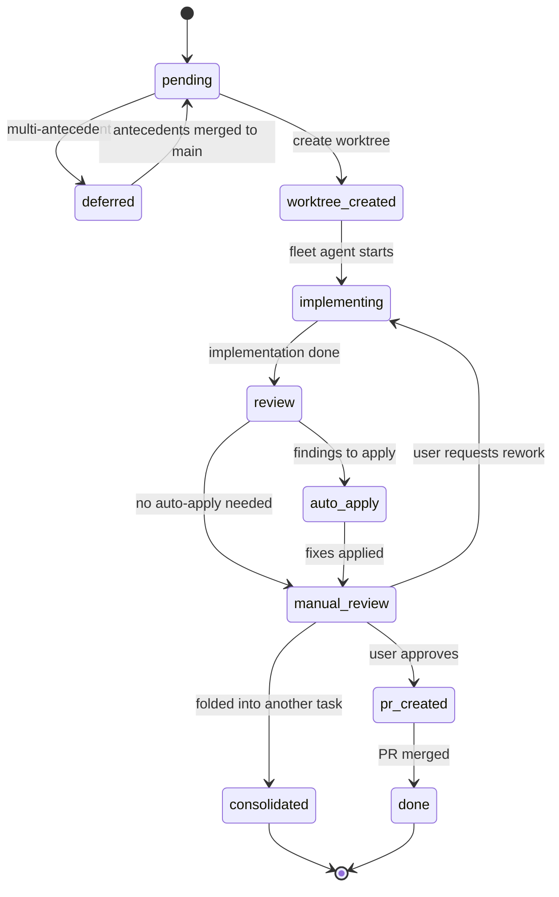

# State Tracking & Resumability

The workflow tracks state in the **Copilot CLI session SQL database** — the same `sql` tool used for `todos` and `todo_deps`. Sessions persist and can be resumed after termination, so SQL state survives across context loss.

The fleet tables coexist with the built-in `todos`/`todo_deps` tables. Where possible, integrate with them: each fleet task is also a `todos` entry (with the same `id`), and `todo_deps` captures the DAG edges. The `fleet_*` tables add fleet-specific columns (layer, worktree, branch, PR, etc.) that `todos` doesn't have.

## Schema

```sql
-- Use the built-in todos table for core task tracking
-- INSERT INTO todos (id, title, description, status) VALUES (...)
-- INSERT INTO todo_deps (todo_id, depends_on) VALUES (...)

-- Fleet-specific metadata (JOIN with todos on id)
CREATE TABLE IF NOT EXISTS fleet_pipeline (
    key TEXT PRIMARY KEY,
    value TEXT
);
-- e.g. ('description', 'Unify Integration Test Run Modes'),
--      ('repo_root', 'C:\_SRC\ZTS'),
--      ('worktree_root', 'C:\_SRC\ZTS.worktrees\auth-refactor'),
--      ('current_layer', '0')

CREATE TABLE IF NOT EXISTS fleet_tasks (
    id TEXT PRIMARY KEY,       -- same id as in todos table
    layer INTEGER NOT NULL,
    worktree_slug TEXT,        -- e.g. t3-jwt-provider
    branch_name TEXT,          -- e.g. feature/avilevin/auth-refactor/t3-jwt-provider
    base_branch TEXT,          -- origin/main or parent task's branch
    pr_url TEXT,
    work_item_id TEXT,
    deferred_reason TEXT
);

CREATE TABLE IF NOT EXISTS fleet_subtasks (
    id INTEGER PRIMARY KEY AUTOINCREMENT,
    task_id TEXT NOT NULL,
    description TEXT NOT NULL,
    done INTEGER DEFAULT 0,   -- 0 or 1
    FOREIGN KEY (task_id) REFERENCES fleet_tasks(id)
);

CREATE TABLE IF NOT EXISTS fleet_reviews (
    id INTEGER PRIMARY KEY AUTOINCREMENT,
    task_id TEXT NOT NULL,
    model TEXT NOT NULL,
    severity TEXT,             -- CRITICAL, IMPORTANT, MINOR
    finding TEXT NOT NULL,
    status TEXT DEFAULT 'open', -- open, auto_applied, flagged, dismissed
    FOREIGN KEY (task_id) REFERENCES fleet_tasks(id)
);
```

## Useful Queries

```sql
-- What's the current state of everything?
SELECT t.id, t.title, f.layer, t.status, f.pr_url
FROM todos t JOIN fleet_tasks f ON t.id = f.id
ORDER BY f.layer, t.id;

-- What's ready to work on? (pending, all deps done)
SELECT t.id, t.title, f.layer FROM todos t
JOIN fleet_tasks f ON t.id = f.id
WHERE t.status = 'pending'
AND NOT EXISTS (
    SELECT 1 FROM todo_deps td
    JOIN todos dep ON td.depends_on = dep.id
    WHERE td.todo_id = t.id AND dep.status NOT IN ('done', 'pr_created', 'consolidated')
);

-- Subtask checklists for a task
SELECT description, done FROM fleet_subtasks WHERE task_id = 't3-jwt-provider';

-- Review findings needing attention
SELECT task_id, severity, finding FROM fleet_reviews WHERE status = 'flagged';
```

## Status Values

| Status | Meaning |
|--------|---------|
| `pending` | Waiting for dependencies or layer |
| `worktree_created` | Worktree ready, not yet implementing |
| `implementing` | Fleet agent running |
| `review` | Code review in progress |
| `auto_apply` | Auto-applying review findings |
| `manual_review` | Ready for user review |
| `pr_created` | PR created, awaiting merge |
| `done` | PR merged |
| `consolidated` | Folded into another task |
| `deferred` | Can't process yet (multi-antecedent) |

## Status Flow



## Resuming

On session resume (or after context compaction):

1. Query `fleet_tasks` to rebuild the full picture
2. Run `git worktree list` to validate worktrees on disk
3. For tasks in `implementing` — check `git log` in the worktree for commits
4. Present summary and resume from the first non-terminal task

```
📋 Resuming Fleet Pipeline: "Unify Integration Test Run Modes"
   Layer: 0 of 2

   ✅ t0-manifest — PR created (#14809024)
   ✅ t2-arg — PR created (#14809063)  
   🔍 t5-servicebus — Awaiting manual review  ← YOU ARE HERE
   ⏳ t3-data-acq — Pending (Layer 1)
   ⏳ t6-arn-handler — Pending (Layer 1)
   ⚠️  t7-durabletask — Deferred (multi-antecedent)

   Continue with manual review of t5-servicebus?
```

## Review Files

Detailed review text is saved to the session workspace for reference:

```
files/reviews/
├── layer-0/
│   ├── t0-manifest-synthesis.md
│   ├── t2-arg-synthesis.md
│   └── ...
└── layer-1/
    └── ...
```
