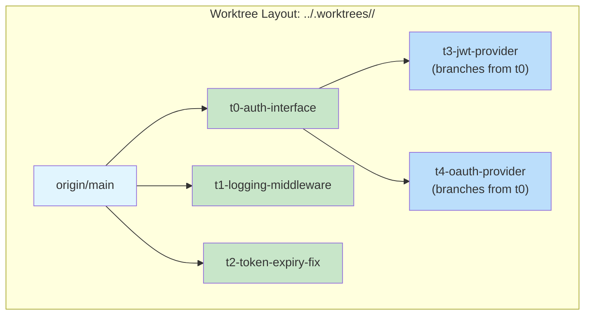

# Worktree Naming Conventions

All worktrees for a pipeline run go into a **dedicated subfolder** named after the swarm. Each worktree and branch includes the task's T-number and slug.

## Layout



## Naming Patterns

| Thing | Pattern | Example |
|-------|---------|---------|
| Swarm subfolder | `../<repo>.worktrees/<swarm-slug>/` | `../ZTS.worktrees/auth-refactor/` |
| Worktree directory | `<swarm-slug>/t<N>-<task-slug>` | `auth-refactor/t3-jwt-provider` |
| Branch name | `<prefix>/<user>/<swarm-slug>/t<N>-<task-slug>` | `feature/avilevin/auth-refactor/t3-jwt-provider` |

### Branch prefix rules

| Context | Prefix |
|---------|--------|
| New functionality | `feature/` |
| Bug fix | `bugfix/` |
| Refactoring / cleanup | `feature/` |
| Experiment | `experiment/` |

## Branching Rules

- **No dependencies** → branch from `origin/main`
- **Single antecedent** → branch from the antecedent's branch
- **Multiple antecedents** → DEFER (don't create worktree yet)

## Example

For swarm "auth-refactor" with user "avilevin":

```powershell
$swarm = "auth-refactor"
$user = "avilevin"
$repoName = "ZTS"
$worktreeRoot = Join-Path (Split-Path $gitRoot -Parent) "$repoName.worktrees" $swarm

# Layer 0: branch from origin/main
git worktree add -b "feature/$user/$swarm/t0-auth-interface" `
    "$worktreeRoot/t0-auth-interface" origin/main

git worktree add -b "feature/$user/$swarm/t1-logging-middleware" `
    "$worktreeRoot/t1-logging-middleware" origin/main

git worktree add -b "bugfix/$user/$swarm/t2-token-expiry-fix" `
    "$worktreeRoot/t2-token-expiry-fix" origin/main

# Layer 1: branch from parent task's branch
git worktree add -b "feature/$user/$swarm/t3-jwt-provider" `
    "$worktreeRoot/t3-jwt-provider" "feature/$user/$swarm/t0-auth-interface"

git worktree add -b "feature/$user/$swarm/t4-oauth-provider" `
    "$worktreeRoot/t4-oauth-provider" "feature/$user/$swarm/t0-auth-interface"
```

## Gitgraph Visualization

```mermaid
gitgraph
    commit id: "main"

    branch "feature/user/auth-refactor/t0-auth-interface"
    commit id: "T0: extract IAuthProvider"
    branch "feature/user/auth-refactor/t3-jwt-provider"
    commit id: "T3: implement JWT"

    checkout "feature/user/auth-refactor/t0-auth-interface"
    branch "feature/user/auth-refactor/t4-oauth-provider"
    commit id: "T4: implement OAuth"

    checkout main
    branch "feature/user/auth-refactor/t1-logging-middleware"
    commit id: "T1: structured logging"
    branch "feature/user/auth-refactor/t5-request-tracing"
    commit id: "T5: request tracing"

    checkout main
    branch "bugfix/user/auth-refactor/t2-token-expiry-fix"
    commit id: "T2: fix token expiry"
    branch "bugfix/user/auth-refactor/t6-token-refresh-tests"
    commit id: "T6: refresh tests"
```

> Deferred tasks (T7, T8, T9) branch from updated main after their antecedent PRs merge.
